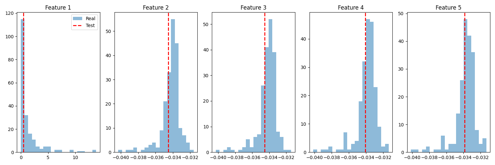
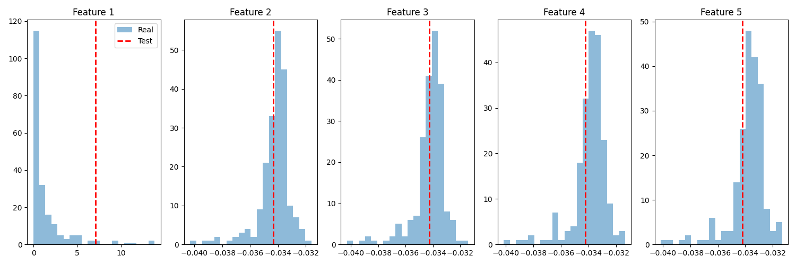

# DePixel
Python-based tool designed to distinguish between real and AI-generated images.

The method uses Learned Noise Patterns (LNP) and one-class classification to map real images to a dense subspace, allowing detection of generated images as outliers. This approach achieves good detection accuracy while using much less training data compared to previous methods.

## Features

- Denoising network for LNP extraction
- Feature extraction from LNP amplitude spectra
- One-class SVM classifier for image authenticity prediction
- Robustness to various image post-processing operations

## Installation

1 + 2. Clone the repository and create a virtual environment (optional but recommended):
```
git clone https://github.com/Linear-Fox-Labs/DePixel
cd DePixel
pip install -r requirements.txt
```

## Usage
1. Prepare your dataset:
- Place real images in the `data/real_images/` directory
- Place test images (real or AI-generated) in the `data/test_images/` directory
2. Run the main script.

## Output

- Console output with processing details and classification results
- Feature distribution plots saved as PNG files in the project directory

<table>
  <tr>
    <td></td>
    <td></td>
  </tr>
  <tr>
    <td>Real Image Dog1.jpg</td>
    <td>Ai-Generated Image Dog2.jpg</td>    
  </tr>
</table>

## Customization
- Adjust `IMAGE_SIZE` in `main.py` to change the input image size
- Modify `PLOT_FEATURES` in `main.py` to change the number of features displayed in distribution plots
- Fine-tune classifier parameters in `src/classifier.py` for better performance

## Acknowledgments
- DePixel based on: Xiuli Bi, Bo Liu, et al. for their research paper "Detecting Generated Images by Real Images Only" https://arxiv.org/abs/2311.00962